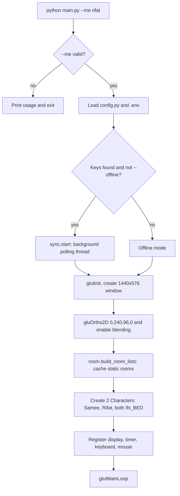
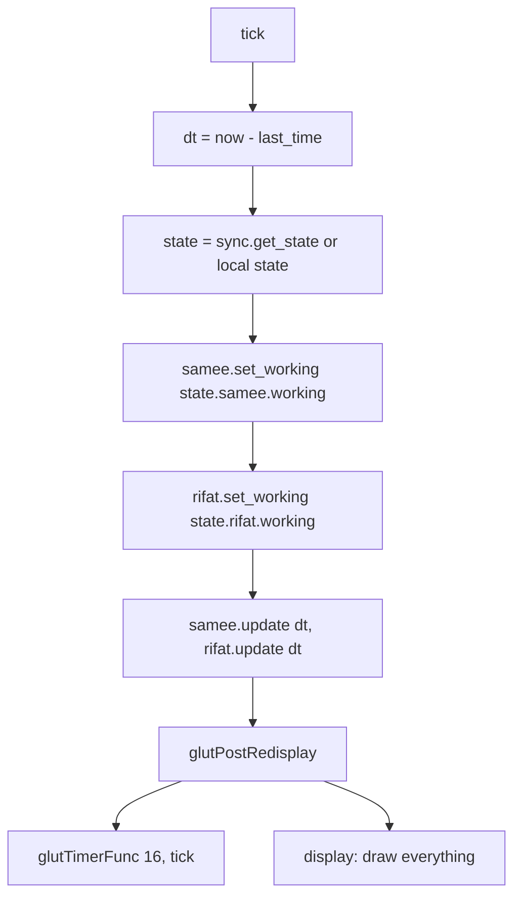
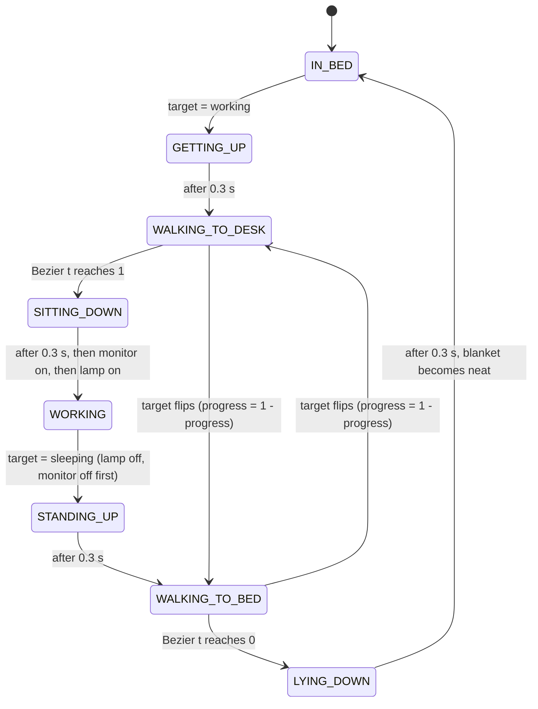
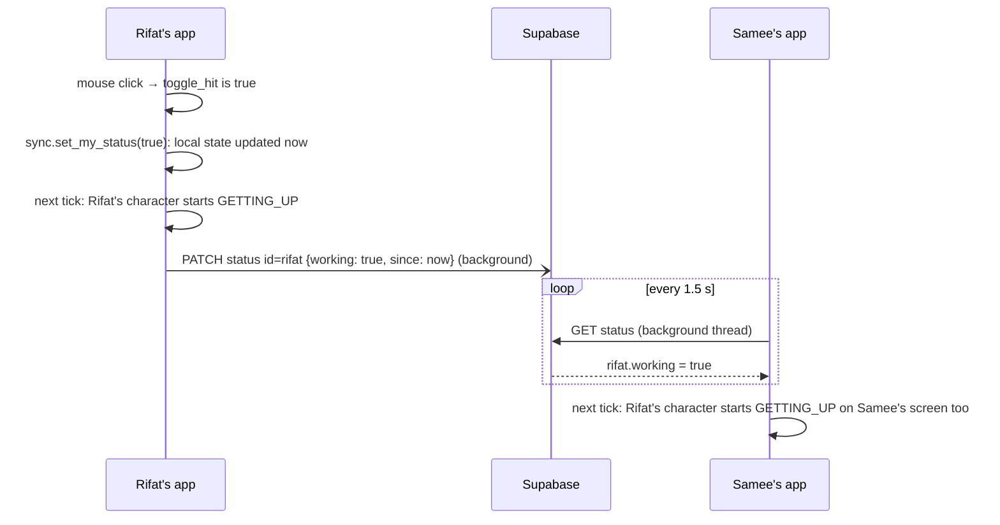
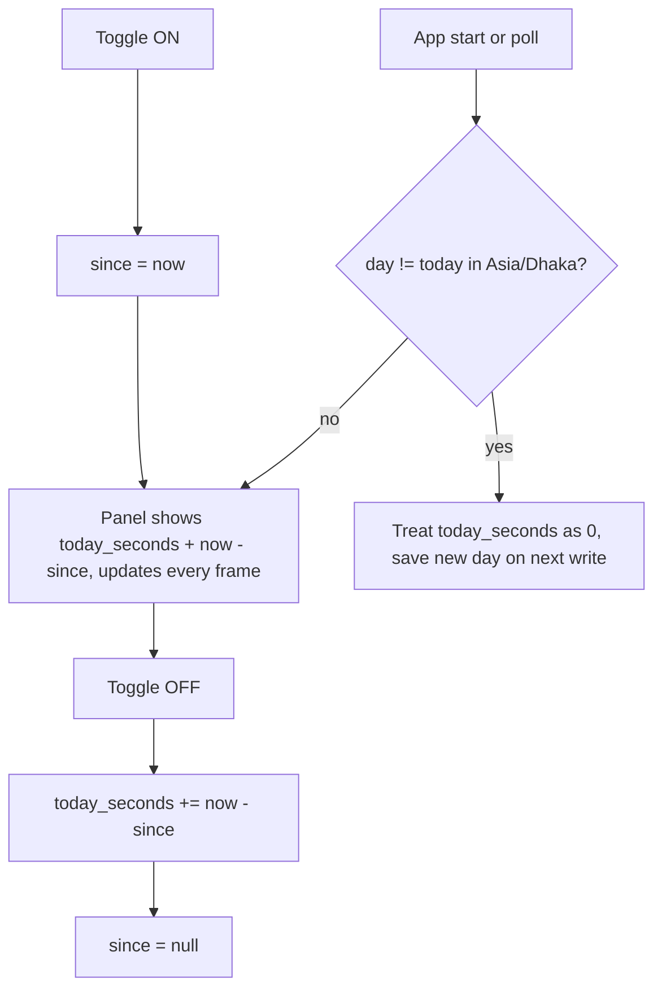
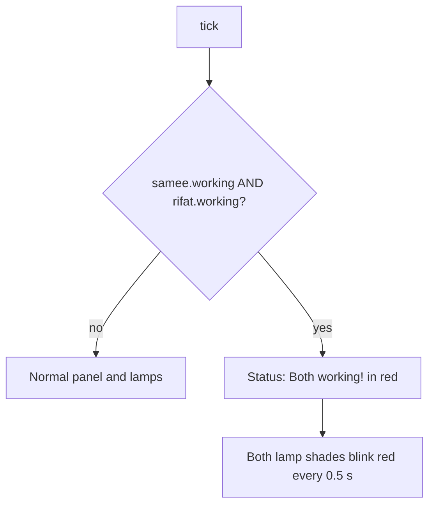
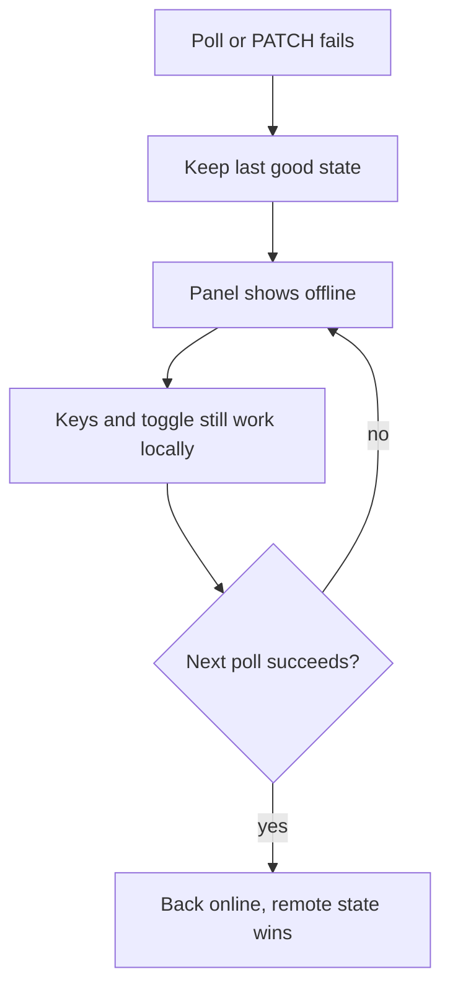

# Work•Sleep•Repeat — App Flow

This file explains what happens, step by step, from starting the app to a toggle appearing on the other person's screen.

## 1. Startup



## 2. The main loop (every ~16 ms)



**Key idea:** the sync state says what *should* happen. The character's state machine decides *how* to get there with animation. The two never fight each other.

## 3. Character state machine



What's on screen in each state:

| State | Sprite | Bed | Monitor | Lamp |
|---|---|---|---|---|
| `IN_BED` | head on pillow | neat | off | off |
| `GETTING_UP` | standing beside bed | messy | off | off |
| `WALKING_TO_DESK` | walk frames on the curve | messy | off | off |
| `SITTING_DOWN` | sitting (with squash) | messy | off | off |
| `WORKING` | sitting + typing | messy | on (after 0.3 s) | on (after 0.6 s) |
| `STANDING_UP` | standing at chair | messy | off | off |
| `WALKING_TO_BED` | walk frames, curve reversed | messy | off | off |
| `LYING_DOWN` | standing beside bed | messy | off | off |

States like `GETTING_UP` and `SITTING_DOWN` can't be interrupted. They are short (0.3 s), and the new target is applied once they finish.

## 4. Toggle flow (the full journey)

When Rifat clicks the toggle:



- Rifat sees his own change **instantly**, because the local update comes first.
- Samee sees it within **about 1.5–3 s**, depending on the poll timing.

## 5. Input map

| Input | Online mode | Offline mode |
|---|---|---|
| Click toggle | toggles **my** status and syncs it | toggles my status locally |
| `1` | toggles Samee locally (demo only, not synced) | toggles Samee |
| `2` | toggles Rifat locally (demo only, not synced) | toggles Rifat |
| `D` | debug overlay on/off | same |
| `G` | grid lines on/off | same |
| `ESC` | quit | same |

In online mode, a remote update overrides a local `1`/`2` change on the next poll. This is expected, since keys are for demos.

## 6. Time tracking flow



## 7. Conflict flow (both working)



This warns about exactly the problem the app exists to prevent.

## 8. Draw order per frame

```
1. Clear screen
2. Samee's room (translate only)
   a. static room display list (neat or messy)
   b. screen + lamp shade (dynamic)
   c. character
   d. darkness → glow → rays → screen glow
   e. emissive parts (screen, lamp shade, bulb) redrawn on top
3. Rifat's room (translate + reflect), same steps
4. Divider and outer frame
5. Name labels (not mirrored)
6. Panel
7. Debug overlay (if on)
8. Swap buffers
```

## 9. Offline / failure flow


